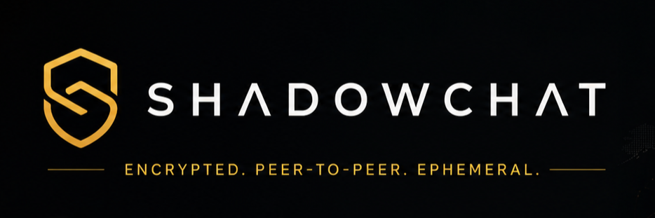

<p align="center">
  
</p>

<p align="center">
  <strong>Distributed, Zero-Knowledge, End-to-End Encrypted P2P Transfer Platform</strong><br/>
  <sub>Server is mathematically blind to all payloads, keys, and identities</sub>
</p>

<p align="center">
  <a href="https://github.com/paultanay/shadowchat/actions"></a>
  
  
  
  
  <a href="LICENSE"></a>
</p>

---

## What is ShadowChat?

ShadowChat is a **distributed peer-to-peer communication and file transfer platform** where the signaling server is architecturally blind to all content. Files transfer directly between browser peers over WebRTC DataChannels, encrypted end-to-end with AES-256-GCM. The server relays only opaque signaling envelopes (SDP, ICE candidates) — it never sees plaintext, keys, or filenames.

This is not a demo. It is a full-stack distributed system built with the same engineering discipline applied to production-grade infrastructure.

---

## Architecture Overview

```
┌──────────────────────────┐         WebRTC DataChannel (P2P)         ┌──────────────────────────┐
│       Browser A          │ ════════════════════════════════════════► │       Browser B          │
│                          │                                           │                          │
│  Transfer Engine         │    ┌─────────────────────────────────┐    │  Transfer Engine         │
│  ├─ 4× DataChannels      │    │      SIGNALING SERVER (Go)       │    │  ├─ 4× DataChannels      │
│  ├─ AES-256-GCM/chunk    │    │                                  │    │  ├─ AES-256-GCM/chunk    │
│  ├─ Backpressure ctrl    │    │  Fiber (HTTP/WS) + JWT Auth      │    │  ├─ Backpressure ctrl    │
│  └─ SHA-256 integrity    │◄──►│  Hub (in-process room routing)   │◄──►│  └─ SHA-256 integrity    │
│                          │    │  NATS (cross-instance pub/sub)   │    │                          │
│  Crypto Engine           │    │  Redis (presence / rate-limit)   │    │  Crypto Engine           │
│  ├─ X25519 key exchange  │    │  PostgreSQL (room metadata)      │    │  ├─ X25519 key exchange  │
│  ├─ Ed25519 signatures   │    │  coturn (STUN/TURN relay)        │    │  ├─ Ed25519 signatures   │
│  └─ HKDF room key        │    └─────────────────────────────────┘    │  └─ HKDF room key        │
└──────────────────────────┘                                           └──────────────────────────┘
```

**Data flow by concern:**

| Layer | Transport | Encryption | Server knowledge |
|---|---|---|---|
| File transfer | WebRTC DataChannel (DTLS) | AES-256-GCM (E2E) | **Zero** |
| Chat messages | WebRTC DataChannel (DTLS) | AES-256-GCM (E2E) | **Zero** |
| Signaling (SDP/ICE) | WSS | TLS (transport only) | Encrypted envelopes |
| Presence heartbeat | WSS → Redis | TLS (transport only) | Timestamps only |
| Room metadata | HTTPS → PostgreSQL | TLS + client-side AES | Encrypted blobs |

---

## Cryptographic Protocol

### Key Exchange (per peer pair)

```
Peer A                          Signaling Server (blind relay)          Peer B
│                                        │                                │
│  1. Generate X25519 keypair            │                                │
│     Generate Ed25519 keypair           │                                │
│  2. Sign(X25519_pub_A, Ed25519_priv_A) │                                │
│  3. Send { x25519_pub_A,               │                                │
│            ed25519_pub_A,              │ ──── relay (opaque) ────────► │
│            signature_A }              │                                │
│                                        │    4. Verify signature_A      │
│                                        │    5. Same steps for B ───────│
│  ◄─── relay (opaque) ──────────────── │◄─── { x25519_pub_B,           │
│                                        │       ed25519_pub_B,          │
│  6. Verify signature_B                 │       signature_B }           │
│  7. sharedSecret = X25519(priv_A, pub_B)                               │
│  8. roomKey = HKDF-SHA256(sharedSecret, salt=roomId, info="shadowchat-v1-room-key")
│                                                                         │
│  ═══════════════ Secure channel — identical roomKey on both sides ══════│
```

**Why this works:** Ed25519 signatures bind each X25519 public key to its originating peer — a passive relay attack cannot substitute keys. HKDF domain-separates the output with a room-scoped info string so the same DH secret can never be reused across rooms.

### Encryption Stack

| Primitive | Algorithm | Purpose |
|---|---|---|
| Key exchange | X25519 (RFC 7748) | Ephemeral ECDH room key agreement |
| Identity binding | Ed25519 (RFC 8032) | Prevent MITM key substitution |
| Key derivation | HKDF-SHA-256 (RFC 5869) | Domain-separated session key derivation |
| Symmetric encryption | AES-256-GCM (NIST SP 800-38D) | Authenticated encryption of all payloads |
| File key wrapping | AES-256-GCM (envelope encryption) | Per-file ephemeral key wrapped in room key |
| Integrity | SHA-256 (FIPS 180-4) | End-to-end file integrity verification |
| Randomness | `crypto.getRandomValues()` (CSPRNG) | IV/nonce generation (12 bytes, unique per op) |

### Zero-Knowledge Invariants (enforced in code, not just policy)

```
INVARIANT 1:  Server stores zero plaintext — all content encrypted client-side before transit
INVARIANT 2:  Server never possesses encryption keys — key exchange over authenticated P2P channel
INVARIANT 3:  Room keys are NON-EXTRACTABLE CryptoKey objects — XSS cannot call exportKey()
INVARIANT 4:  Files transfer P2P — server never proxies file bytes, even via TURN (DTLS-encrypted)
INVARIANT 5:  Every AES-GCM operation uses a unique 96-bit IV — GCM nonce reuse is impossible
INVARIANT 6:  Ed25519 identity keys sign X25519 exchange keys — active MITM is cryptographically detected
```

---

## File Transfer Engine

Files are split into **64 KB chunks**, each independently encrypted with a per-file ephemeral AES key, then streamed across **4 parallel WebRTC DataChannels** for maximum pipe saturation.

### Wire Format (per chunk)

```
┌──────────────┬────────────────────┬──────────┬───────────────────────────────────┐
│ Transfer ID  │  Chunk Index (u32) │  IV (12B)│   AES-256-GCM Ciphertext + Tag    │
│   (16 bytes) │                    │          │   (up to 64 KB + 16B auth tag)    │
└──────────────┴────────────────────┴──────────┴───────────────────────────────────┘
```

### Backpressure Control

The sender monitors each DataChannel's `bufferedAmount`. When it crosses the **1 MB high-watermark**, it suspends sending and awaits the `bufferedamountlow` event (threshold: 64 KB) before resuming. This prevents memory saturation on constrained clients without relying on polling.

### Performance Architecture

- **4 parallel DataChannels** — saturates available bandwidth by multiplexing across independent SCTP streams
- **Web Workers for crypto** — AES-GCM encryption and SHA-256 hashing are offloaded off the main thread; UI stays at 60 fps during gigabyte transfers
- **Adaptive chunk sizing** — chunk size adjusts between 16 KB and 256 KB based on measured throughput delta
- **Resumable transfers** — chunk bitmap and partial file persisted in IndexedDB; resumed from first missing chunk after reconnect

---

## Signaling Server (Go)

The Go backend is a **stateless-friendly horizontally-scalable** WebSocket hub. Two instances serving the same room communicate via **NATS pub/sub** — chosen over Kafka because signaling messages are ephemeral (a stale SDP offer is harmful, not recoverable), and NATS delivers sub-millisecond fanout versus Kafka's durable-log overhead.

### Why NATS, not Kafka?

| Property | NATS | Kafka |
|---|---|---|
| Latency | < 1ms (ephemeral fire-and-forget) | 5–10ms minimum (log flush) |
| Durability | Not needed — stale SDP = broken connection | Core feature (log replay) |
| Operational weight | Single binary, zero dependencies | Brokers + KRaft + topic partitioning |
| Fit | **WebRTC signaling fan-out** | Analytics pipelines, audit logs |

Kafka would be the right choice if we built an audit trail or analytics pipeline — it is not the right tool for ephemeral real-time signaling.

### Hub Pattern

```go
// Cross-instance delivery: Hub A → NATS → Hub B → WebSocket
// Local delivery: Hub → in-memory room map → WebSocket (zero NATS overhead)
// Anti-loop: each NATS-delivered message carries originating instance ID
//            to prevent re-publishing it back to NATS
```

### JWT + WebSocket Authentication

JWTs are passed as a query parameter at WebSocket upgrade time (`?token=...`) — the only browser-native mechanism since the `Upgrade` HTTP request does not support custom headers. The token is validated by middleware **before** the upgrade completes; unauthenticated connections are rejected at the HTTP layer, never reaching the hub.

### TURN Credential Security

Ephemeral TURN credentials are generated server-side using **HMAC-SHA1** over a timestamp-scoped username (per the TURN REST API spec, RFC 8489). Credentials carry a configurable TTL (default: 24h) and are scoped to the requesting peer's room claim — unauthorized relay usage is prevented by the shared TURN secret.

---

## Technology Decisions

| Component | Choice | Why |
|---|---|---|
| Signaling server | Go + Fiber | Low goroutine overhead per WS connection; predictable GC latency |
| Frontend | Next.js 16 (App Router) | RSC for zero-JS landing page; edge-compatible SSR |
| State management | Zustand | Minimal re-render surface; direct store access from engine callbacks |
| In-process pub/sub | NATS | Sub-ms ephemeral fanout — correct for signaling, unlike Kafka |
| Session cache / presence | Redis | TTL-based presence expiry; rate-limit counters with INCR atomicity |
| Persistent metadata | PostgreSQL (Neon) | Encrypted room blobs; ACID guarantees for room lifecycle |
| Crypto primitives | Web Crypto API (SubtleCrypto) | Hardware-accelerated, browser-native, no third-party crypto libs |
| Local data | Dexie.js (IndexedDB) | Resumable transfer state; encrypted message cache |
| TURN relay | coturn (self-hosted) | HMAC-signed ephemeral creds; full DTLS passthrough (server stays blind) |

---

## Repository Structure

```
shadowchat/
├── backend/
│   ├── cmd/server/             # Application entrypoint
│   └── internal/
│       ├── hub/                # WebSocket hub — room routing, client read/write pumps
│       │   ├── hub.go          # NATS-backed broadcast, anti-loop instance ID
│       │   ├── client.go       # Per-client goroutines (readPump/writePump), ping/pong
│       │   └── message.go      # SignalMessage type, serialization
│       ├── crypto/
│       │   ├── jwt.go          # HS256 token generation/validation, room claims
│       │   └── turn.go         # HMAC-SHA1 ephemeral TURN credential generation
│       ├── handler/            # HTTP/WS route handlers
│       ├── service/            # Room business logic (create, join, expire, lock)
│       ├── repository/         # PostgreSQL data access layer
│       ├── nats/               # NATS broker lifecycle management
│       ├── redis/              # Redis presence tracking, rate limiting
│       └── middleware/         # JWT auth middleware, rate limiting
├── frontend/
│   └── src/
│       ├── lib/
│       │   ├── crypto/
│       │   │   ├── aes.ts      # AES-256-GCM encrypt/decrypt helpers
│       │   │   ├── hkdf.ts     # HKDF-SHA-256 room key derivation (non-extractable)
│       │   │   ├── keys.ts     # X25519 + Ed25519 key generation and JWK export
│       │   │   └── integrity.ts# SHA-256 file integrity (offloaded to Web Worker)
│       │   └── engines/
│       │       ├── crypto.ts   # Key exchange orchestration, envelope encryption
│       │       ├── webrtc.ts   # RTCPeerConnection state machine, offer/answer lifecycle
│       │       ├── signaling.ts# WebSocket client, reconnect, queued message replay
│       │       ├── transfer.ts # Chunking, backpressure, parallel channels, reassembly
│       │       └── storage.ts  # Dexie.js IndexedDB schema and access helpers
│       ├── stores/
│       │   ├── roomStore.ts    # Zustand: P2P session lifecycle, peer management
│       │   └── uiStore.ts      # Zustand: toast, modals, UI state
│       └── workers/
│           └── hash.worker.ts  # Off-thread SHA-256 via hash-wasm
└── docker-compose.yml          # Full local stack: PG + Redis + NATS + coturn + app
```

---

## Local Development (Docker Compose)

```bash
# Clone and boot the full stack
git clone https://github.com/paultanay/shadowchat
cd shadowchat
docker compose up --build -d
```

Open **`http://localhost:3001`** — no manual database setup, the backend auto-migrates on startup.

```bash
# Optional: change ports
FRONTEND_PORT=3002 docker compose up -d

# Optional: enable HTTPS + reverse proxy
docker compose --profile reverse-proxy up -d
# → https://localhost
```

> **First build:** Go and Node dependencies are compiled from scratch. Allow ~3–5 minutes.

### Environment Variables

Copy `.env.example` → `.env` in both `backend/` and root. All defaults are pre-filled for local Docker networking — no manual configuration needed.

---

## Production Deployment

| Layer | Service |
|---|---|
| Frontend | Vercel (Edge Network) |
| Signaling Server | Google Cloud Run (auto-scaling) |
| Database | Neon (serverless PostgreSQL) |
| Cache / Presence | Upstash Redis |
| TURN Relay | Oracle Cloud ARM VM (coturn) |

See [`docs/deployment.md`](docs/deployment.md) for full production setup.

---

## License

Apache 2.0 — see [LICENSE](LICENSE).
